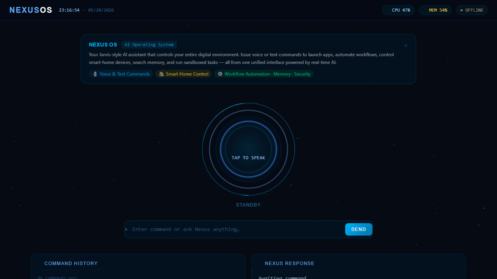
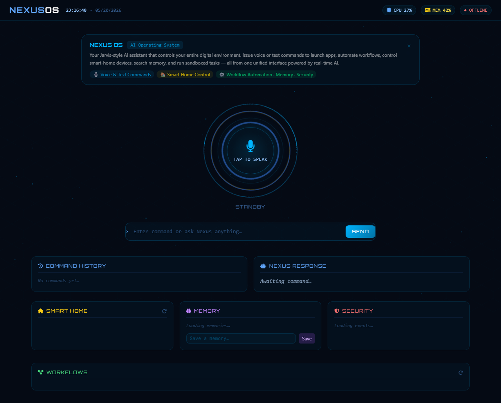
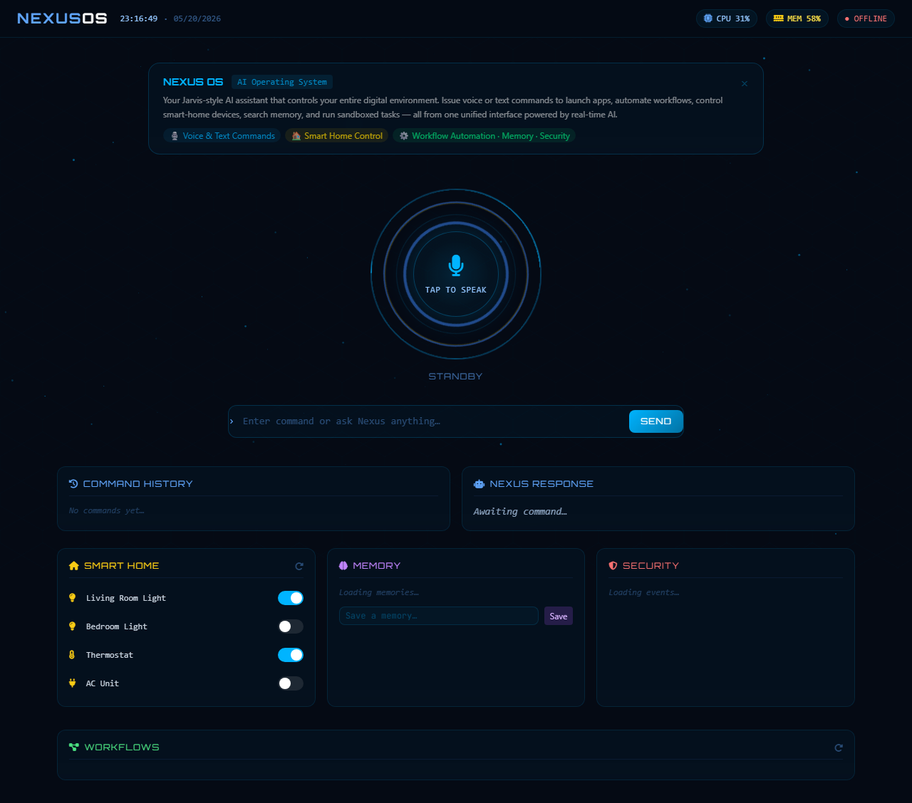
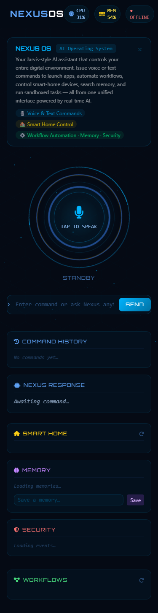

# NexusOS

[](https://github.com/isidhartha/nexus-os/discussions)

## Demo



### Screenshots

| Desktop Dashboard | Feature View | Mobile View |
|------------------|--------------|--------------|
|  |  |  |


I built NexusOS because I wanted a Jarvis — not a toy demo, but something that actually controls my computer, understands what I'm asking, and takes action. This is that project.

It's an AI operating environment that runs locally. You say "Hey Nexus", it wakes up, listens, figures out what you want, and does it. Open Chrome, search for something, move files around, run a script, control your smart home devices — all through voice or text, without touching the keyboard.

---

## What it does

**Voice pipeline** — NexusOS listens for a wake word using your microphone. When it hears "Hey Nexus", it captures your command, transcribes it with OpenAI Whisper (which runs locally), and passes it to the AI brain. When it responds, it speaks back using text-to-speech. The whole loop takes about 2-3 seconds.

**Computer control** — It can move your mouse, click buttons, type text, and interact with any application on your desktop using PyAutoGUI. You tell it what you want to do in plain English, and it figures out the clicks.

**Browser automation** — Built on Playwright, so it can open browsers, navigate to pages, fill forms, click links, and read page content back to you. I use it to look things up without touching the keyboard.

**File management** — Create, move, rename, search, and delete files through voice commands. It operates within safe boundaries and won't touch system directories.

**Autonomous workflows** — You can define multi-step routines — "morning routine", "end of day", whatever you want — and it runs through each step in sequence. Open Slack, check email, pull up your calendar, read you the headlines. Define it once, run it anytime.

**AI memory** — This is the part I'm most proud of. NexusOS remembers things across sessions. Tell it something and it stores it with a vector embedding. Next time you ask something related, it retrieves the right memory. It actually knows context from previous conversations.

**Smart home** — Connects to MQTT, which means it works with Home Assistant and most IoT devices. Turn lights on and off, read sensor data, trigger automations.

**Plugin system** — Drop a Python file into the plugins folder and NexusOS loads it automatically. No configuration needed. Build your own integrations without touching the core.

---

## Tech stack

The backend is Python — FastAPI serving a REST API and WebSocket connections, Whisper for speech recognition, pyttsx3 for text-to-speech, PyAutoGUI for computer control, Playwright for browser automation, SQLite with vector embeddings for memory, and Paho MQTT for IoT.

The frontend is React with Tailwind CSS — a dashboard that shows real-time transcriptions, command history, your memory entries, and smart home controls.

Everything runs in Docker, so you don't have to install audio libraries on your host machine unless you want to use the actual microphone.

---

## How to run it

### Prerequisites
- Python 3.10+
- Node.js 18+
- Git
- Redis (`redis-server`)
- PostgreSQL 13+ with database `nexusdb` created
- Ollama (optional, for running without any API key — https://ollama.com)
- Mosquitto MQTT broker (optional, for smart home features — https://mosquitto.org)

### Setup

```bash
# 1. Clone and enter the project
git clone https://github.com/isidhartha/nexus-os
cd nexus-os

# 2. Create virtual environment
# Windows:
python -m venv venv
venv\Scripts\activate
# Mac/Linux:
python3 -m venv venv
source venv/bin/activate

# 3. Install Python dependencies
pip install -r core/requirements.txt

# 4. Install Playwright browsers (for browser automation)
playwright install chromium

# 5. Configure environment
# Windows:
copy .env.example .env
# Mac/Linux:
cp .env.example .env
# Open .env and fill in at least one AI provider key
# OR set AI_PROVIDER=ollama to run without any API key

# 6. Start services
# Redis (in a terminal):
redis-server
# PostgreSQL must be running — create the database once:
# psql -U postgres -c "CREATE DATABASE nexusdb;"
# MQTT (optional — skip if not using smart home):
# Windows: mosquitto  |  Mac: brew services start mosquitto  |  Linux: sudo systemctl start mosquitto

# 7. Run the backend
uvicorn core.main:app --reload --port 8002

# 8. Run the frontend (in a new terminal, from project root)
cd frontend
npm install
npm run dev -- --port 3002
```

**Dashboard**: http://localhost:3002  
**API docs**: http://localhost:8002/docs  

To use without a microphone, send text commands directly:
```bash
curl -X POST http://localhost:8002/api/v1/command \
  -H "Content-Type: application/json" \
  -d '{"text": "open chrome and go to github.com", "mode": "text"}'
```

---

## Free local LLM option (no API key needed)

If you don't have OpenAI API credits, you can run NexusOS entirely for free using [Ollama](https://ollama.com) — a local LLM runner that works on Mac, Linux, and Windows.

**1. Install Ollama**

Download and install from https://ollama.com. It takes about 2 minutes.

**2. Pull the model**

```bash
ollama pull llama3.2
```

This downloads a ~2GB model to your machine. You only do this once.

**3. Set the provider in your `.env`**

```
LLM_PROVIDER=ollama
```

Leave `OPENAI_API_KEY` blank — it won't be used.

**4. Start NexusOS as normal**

```bash
docker-compose up --build
```

Ollama needs to be running on your host machine (not inside Docker). If you want to run it inside Docker too, uncomment the `ollama` service in `docker-compose.yml`.

> **Switching back to OpenAI**: set `LLM_PROVIDER=openai` and add your `OPENAI_API_KEY`.

---

## Without a microphone

If you just want to explore the system without voice, use the text command API:

```bash
curl -X POST http://localhost:8000/api/v1/command \
  -H "Content-Type: application/json" \
  -d '{"text": "open chrome and go to github.com", "mode": "text"}'
```

---

## API

The full API reference is in [docs/API.md](docs/API.md). The backend exposes Swagger UI at `http://localhost:8000/docs`.

---

## Architecture

Detailed breakdown of how the voice pipeline, agent system, and memory layer fit together in [docs/architecture.md](docs/architecture.md).

---

## Contributing

If you're building on top of this or want to add a new integration, read [CONTRIBUTING.md](CONTRIBUTING.md) first. The plugin system makes it pretty easy to add new capabilities without modifying core code.

---

## License

MIT. Use it however you want.
