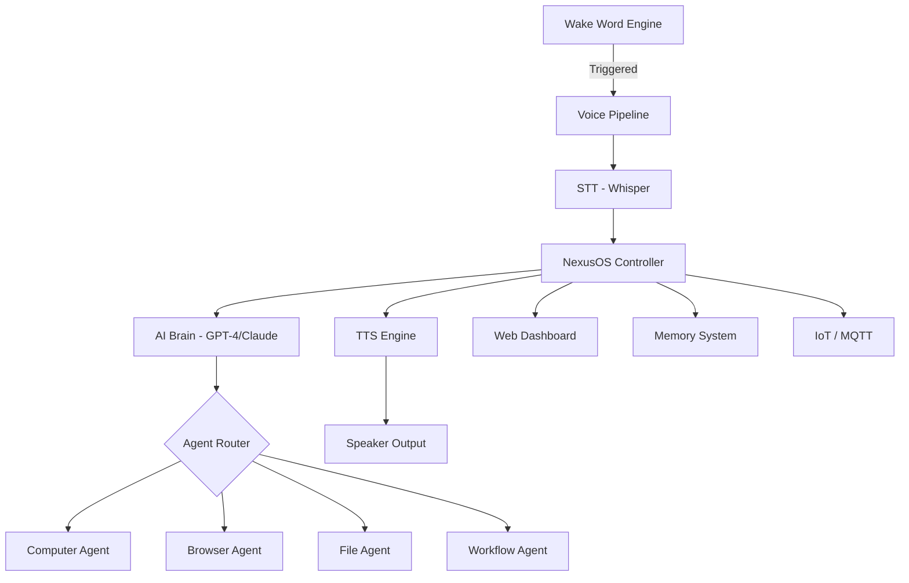

# NexusOS — AI Operating System & Agent Workspace

> **FLAGSHIP PROJECT** — A Jarvis-like AI operating environment for voice-controlled PC automation, autonomous workflows, and intelligent agent orchestration.

[](LICENSE)
[](https://python.org)
[](https://fastapi.tiangolo.com)

## Features

- [x] Wake word detection ("Hey Nexus")
- [x] Voice-controlled PC automation
- [x] Browser control via Playwright
- [x] App launching and file management
- [x] Autonomous multi-step workflows
- [x] Voice identity recognition
- [x] Persistent AI memory system
- [x] Multimodal interactions (voice + text + vision)
- [x] Smart home / IoT integrations via MQTT
- [x] Voice assistant dashboard (web UI)
- [x] Plugin system for extensions

## Architecture



## Tech Stack

| Layer | Technology |
|-------|-----------|
| Backend | FastAPI, Python 3.11+ |
| Voice STT | OpenAI Whisper |
| Voice TTS | pyttsx3 |
| Browser Automation | Playwright |
| PC Automation | PyAutoGUI |
| IoT | Paho MQTT |
| Memory | SQLite + Vector Embeddings |
| Frontend | React 18, Tailwind CSS, Vite |
| Container | Docker, Docker Compose |

## Quick Start

```bash
git clone https://github.com/yourusername/nexus-os
cd nexus-os
cp .env.example .env
# Edit .env with your API keys
docker-compose up --build
```

Open `http://localhost:3000` for the dashboard.

## Configuration

Set your wake word in `.env`:
```
WAKE_WORD=nexus
```

To use a custom wake word, you can optionally configure Porcupine (free tier available).

## API Reference

See [docs/API.md](docs/API.md).

## Architecture Details

See [docs/architecture.md](docs/architecture.md).

## Contributing

See [CONTRIBUTING.md](CONTRIBUTING.md).

## License

MIT — see [LICENSE](LICENSE).
